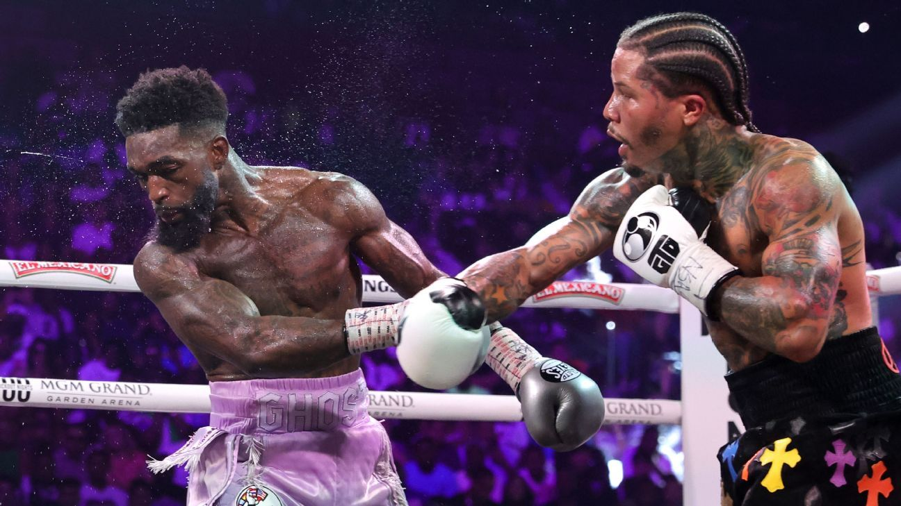

# 📸 Como Adicionar sua Foto de Perfil

## Passo 1: Adicionar a Imagem

1. Salve a sua foto na pasta **`images/`**
2. Renomeie a imagem para **`profile.jpg`** (ou qualquer outro nome)
3. Se usou um nome diferente, edite o arquivo `index.html` e encontre a linha:

```html

```

E substitua `profile.jpg` pelo nome do seu arquivo.

## Formatos Aceitos

- `.jpg` / `.jpeg`
- `.png`
- `.webp`
- `.gif`

## Qualidade Recomendada

- **Largura**: 1200px ou mais
- **Altura**: 600px ou mais
- **Tamanho do arquivo**: Menos de 500KB

## Exemplo de Estrutura de Pastas

```
Static Site/
├── index.html
├── style.css
├── script.js
├── README.md
├── images/
│   └── profile.jpg      ← Coloque sua foto aqui
└── INSTRUCOES.md
```

---

## ✅ Tudo Pronto!

Após adicionar a imagem, seu site estará completo com:

✅ Banner com sua foto e turma (2024T2)  
✅ Seção "Sobre" com suas competências técnicas  
✅ Formulário de contato  
✅ Links de redes sociais em manutenção  
✅ Integração com GitHub  
✅ Design responsivo

Abra o arquivo `index.html` no navegador para visualizar!
